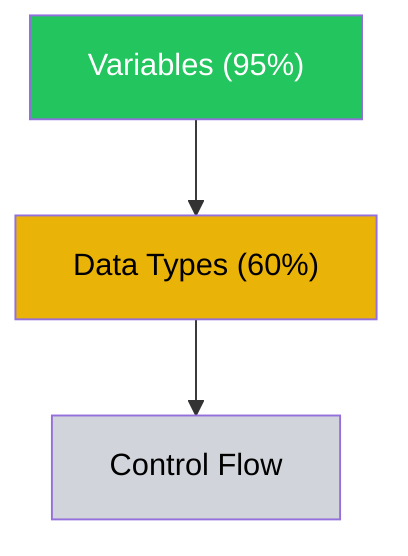

# Dashboard Generator

Generate a React dynamic artifact (.jsx) that serves as the learner's visual home base. It displays the knowledge graph with mastery overlay, curriculum position, key metrics, and upcoming agenda. It must stay synced with the input state (i.e., not static).

## Workspace

All state files live in `learn-anything/<skill-slug>/`. Read `learn-anything/active-skill.json` to find the active skill slug.

## Inputs

Read these files to populate the dashboard:
1. `learn-anything/<skill-slug>/knowledge-graph.json` — The dependency graph with learner mastery overlay
2. `learn-anything/<skill-slug>/learning-plan.json` — Curriculum structure, schedule, milestones
3. `learn-anything/<skill-slug>/progress.json` — Session history, mastery transitions, current state

### Input Verification

Before proceeding, verify all required upstream state files exist and contain expected fields:
- `knowledge-graph.json` exists and contains `graph.vertices`
- `learning-plan.json` exists and contains `curriculum.task_classes`
- `progress.json` may or may not exist
- `active-skill.json` exists and contains `active` field

If any required file is missing or its required fields are absent, report the issue to the user rather than proceeding with partial data.

## Dashboard Layout

Generate a single React component artifact with these sections:

### Section 1: Knowledge Map (primary view, top half)

Render the skill dependency graph with mastery-state coloring:

**Node colors by mastery_category:**
- `mastered` -> green (#22c55e)
- `proficient` -> blue (#3b82f6)
- `familiar` -> yellow (#eab308)
- `attempted` -> orange (#f97316)
- `not_started` -> gray (#d1d5db)

**Node content:** Component name + mastery percentage (from mastery_probability). Show a small progress bar inside each node.

**Edges:** Prerequisite edges as directional arrows. Use solid lines for hard prerequisites, dashed for soft.

**Grouping:** If the knowledge graph has cluster_ids, group nodes into labeled sections.

**Implementation approach:** Use a force-directed or hierarchical layout. For simple graphs (15 or fewer nodes), a hierarchical top-down layout works well. For larger graphs, use a force-directed layout with cluster grouping. Consider using D3 or Recharts for the visualization.

If the graph is large (>20 nodes), provide a module-level summary view with expandable clusters.

### Section 2: Curriculum Roadmap (left panel below map)

Show the task class progression:
- Numbered task classes with names
- Current position highlighted
- Each class shows: completion percentage, mastery gate status (not reached / in progress / passed)
- Milestones from the schedule with expected vs actual timing

**Dual timeline:** Show both the short-term plan and extended roadmap as a visual timeline.

### Section 3: Key Metrics (right panel below map)

Display metrics that reflect ACTUAL LEARNING, not just effort:

**Show:**
- Delayed retention rate: % of material retained when tested after 1+ days
- Components mastered: N of total (with breakdown by mastery level)
- Transfer tasks passed: N completed successfully
- Curriculum velocity: on pace / ahead / behind schedule
- Self-assessment calibration: how well the learner's confidence predictions match their actual performance

**Do NOT show as primary metrics:**
- Total hours practiced (effort, not learning)
- Streak count (gamification that punishes breaks)
- Total cards reviewed (activity, not retention)

These can appear in a secondary "activity" tab but should never be the primary metrics.

### Section 4: Session History (collapsible, bottom)

Recent sessions listed chronologically:
- Date, duration, template used, topics covered
- Key outcomes (mastery transitions, assessment results)
- Compressed session summary

### Section 5: Upcoming (sticky footer or sidebar)

- Next session agenda (from progress.json current_state.next_session_agenda)
- Vertices due for delayed retention review
- Upcoming mastery gates
- Any plateau warnings if plateau_status is "approaching" or "active"

## Design Principles

- **Knowledge graph is the hero.** It should dominate the visual hierarchy. It's the most informative and motivating view — showing where the learner IS, where they're GOING, and how everything connects.
- **Metrics reflect learning, not effort.** Primary metrics are retention, transfer, and mastery. Activity metrics (hours, streaks, cards) are secondary at best.
- **Decay is visible but non-punitive.** If mastery has decayed on a node (FSRS retrievability dropped), show it fading rather than red/alarming. Tooltip: "Ready for a refresher" rather than "Skill lost!"
- **Progress is honest and motivating.** Don't inflate. Don't deflate. Show real state clearly.
- **Responsive.** Works in the Claude artifact panel. Use Tailwind for layout.

## Generation Process

1. Read all three input files
2. Extract: graph vertices with mastery states, curriculum position, session history, metrics
3. Compute derived metrics: retention rate, calibration accuracy, velocity
4. Generate a self-contained React component using:
   - React hooks (useState, useEffect, useMemo)
   - Tailwind CSS for styling
   - Recharts or D3 for the knowledge graph visualization
   - Lucide-react for icons
5. All data should be embedded directly in the component (not fetched from an API)

## Regeneration

The dashboard is regenerated (not updated in-place) after significant state changes:
- After each training session (Conductor writes new progress state)
- After external data import processing
- After curriculum re-sequencing
- On learner request

Each regeneration reads the current state of all JSON files and produces a fresh artifact.

## Mermaid Fallback

If a full interactive React visualization is too complex for the current context, fall back to a Mermaid diagram for the knowledge graph plus a simpler Markdown progress summary. The Mermaid graph should still use color coding and progress indicators:

## Handoff

After generating the React artifact, the system is ready for training sessions. No downstream skill consumes the dashboard — it is a terminal output for the learner's reference. The orchestrator routes subsequent requests to the Training Conductor.
