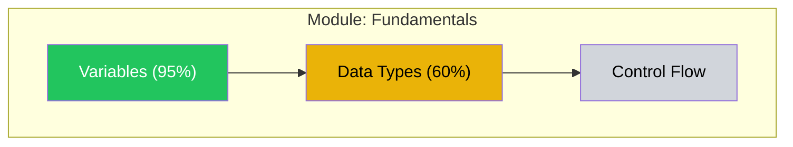

# Material Forge

Act as the production engine of a meta-learning system. Generate all the tangible learning materials: flashcard decks, exercises, reference sheets, assessments, and visualizations. Quality is make-or-break — bad materials produce bad learning.

## Workspace

All state files live in `learn-anything/<skill-slug>/`. Read `learn-anything/active-skill.json` to find the active skill slug.

## Inputs

Before starting, read:
1. `learn-anything/<skill-slug>/learning-plan.json` — The curriculum: task classes, sequences, session templates, SRS schedule
2. `learn-anything/<skill-slug>/knowledge-graph.json` — The skill graph with learner overlay (for difficulty calibration and transfer-leveraged analogies)
3. `schemas/srs-cards.schema.json` — Flashcard output format
4. `references/card-design-guide.md` — Card design principles and anti-patterns
5. `references/quality-rubrics.md` — Quality checks for all material types
6. `../training-conductor/references/session-templates.md` — Session templates (for designing template-aligned materials)

### Input Verification

Before proceeding, verify all required upstream state files exist and contain expected fields:
- `learning-plan.json` exists and contains `curriculum.task_classes` (non-empty array)
- `knowledge-graph.json` exists and contains `graph.vertices`
- `active-skill.json` exists and contains `active` field

If any required file is missing or its required fields are absent, report the issue to the user rather than proceeding with partial data.

## Generation Modes

Material Forge operates in two modes:

**Full generation** (after curriculum is created): Generate the complete material set for the initial curriculum — flashcards for all task classes, worked examples, reference materials, assessments, and the dependency graph visualization.

**On-demand generation** (during training): The Training Conductor requests specific materials for an upcoming session. Generate only what's needed for that session.

## Material Generation Process

### 1. SRS Flashcard Decks

For each task class in the learning plan:

1. Identify all vertices covered by this task class
2. For each vertex, determine the appropriate card types from `references/card-design-guide.md`
3. Generate 2-5 cards per vertex (more for complex concepts, fewer for simple facts)
4. Apply anti-pattern checks: no kitchen sink, no ambiguous cloze, no yes/no, no shopping lists, no pattern matching
5. Tag each card: component_id, topic_tags (hierarchical with :: separator), bloom_level, knowledge_type, difficulty_estimate, curriculum_position
6. Set curriculum_position so cards for earlier task classes come first
7. **Visual audit pass**: After generating all text cards for a task class, review each card and ask: "Does this concept have a spatial, sequential, comparative, or structural dimension that text alone handles poorly?" If yes, add an `image_svg` field with inline SVG and set `image_placement` (`"front"`, `"back"`, or `"both"`). See `references/card-design-guide.md` for the visual heuristic, SVG constraints, and card field format. Not every card needs a visual — only add where a diagram meaningfully aids retrieval.

**Generate the anki_config** once per plan:
```python
import random
anki_config = {
    "model_id_basic": random.randrange(1 << 30, 1 << 31),
    "model_id_cloze": random.randrange(1 << 30, 1 << 31),
    "model_id_reversed": random.randrange(1 << 30, 1 << 31),
    "deck_id": random.randrange(1 << 30, 1 << 31)
}
```
Store in srs-cards.json and NEVER change these IDs.

Write the complete card set to `learn-anything/<skill-slug>/srs-cards.json` conforming to the schema. Then run the Anki export script at `scripts/generate_anki.py` (located within this skill's directory) with the srs-cards.json path as input to produce the .apkg file in the skill workspace.

### 2. Worked Examples with Backward Fading

For each task class, generate a fading sequence:

1. Pick a representative problem for the class
2. Write a full worked solution with step-by-step explanation
3. At each step, include a self-explanation prompt: "Why does this step work?"
4. Create the fading sequence by removing the LAST step first:
   - Version 1: All steps shown, learner explains each
   - Version 2: Last step removed, learner completes it
   - Version 3: Last 2 steps removed
   - ... until:
   - Version N: No steps shown, learner does it all

Adjust fading pace to learner level (from knowledge graph): novice = 1 step per 2 problems, intermediate = 1 per problem, advanced = 2 per problem.

Vary surface features across versions (different numbers, scenarios, contexts) while keeping the deep structure identical.

### 3. Productive Failure Scenarios

For each productive failure point flagged in the learning plan:

1. Read the naive theory the scenario should surface
2. Design a problem that:
   - Activates prior knowledge (references something already learned)
   - Has 3-5 plausible solution approaches (not just one right way)
   - Is challenging but not impossible
   - Has NO embedded hints, scaffolding, or direction toward the canonical answer
3. Prepare the consolidation instruction (delivered AFTER the struggle):
   - Explicitly bridges likely student attempts to the canonical solution
   - Shows how the naive theory breaks down and why the correct understanding works
4. Prepare a transfer problem for post-consolidation verification

### 4. Interleaved Practice Sets

For each session that includes interleaving:

1. Compose the set: 25% current topic, 75% review (weight recent topics more)
2. Sequence so no two consecutive problems use the same strategy
3. Include at least one discrimination pair (similar surface, different deep structure)
4. Calibrate difficulty to 75-85% target accuracy for the learner's current level
5. Include brief "why this strategy?" prompts after solutions (builds discrimination skill)

### 5. Reference Materials

**Prescriptive one-pager** — For each task class or major concept cluster:
- Title and scope
- Core rules/principles (numbered, concise)
- 2-3 examples showing the rules in action
- Common mistakes to avoid
- Format for quick reference, not sequential reading

**Practice one-pager** — Companion to the prescriptive one-pager:
- 3-5 concrete examples demonstrating the principles
- Annotated to show which principle each example illustrates

Generate as Markdown files. If PDF export is needed, use the pdf skill.

**External resource list** — Curated recommendations:
- Best books/courses for self-teaching (from the Researcher's findings)
- Video resources for visual/motor learning
- Community links (forums, Discord, subreddits)
- Tool recommendations

### 6. Dependency Graph Visualization

Generate a Mermaid flowchart showing the skill graph with mastery overlay:



Rules:
- 20 or fewer nodes per diagram (split into module views for larger graphs)
- Color-code: green=mastered, yellow=developing, gray=not-started, dashed=locked
- Include percentage or progress indicator in node labels
- Group into subgraphs by cluster_id from the knowledge graph
- Prerequisite arrows flow top to bottom

### 7. Assessment Instruments

For each mastery gate in the learning plan, generate:
- 3-5 assessment items at the specified Bloom's level
- Surface features varied from instruction
- Scoring rubric for each item
- Anti-gaming: open-ended, explanation-requiring

For delayed retention tests:
- Items that test the same deep structure as instruction but with different surface features
- No scaffolding or context cues

For transfer tasks:
- Near-transfer: same principle, slightly different context
- Far-transfer: same principle, significantly different domain

### 8. Encoding Aids

For each vertex with difficulty_estimate > 0.5 or bloom_level in [remember, understand]:
- Generate a mnemonic or memory hook if the content is amenable
- Create analogies connecting to the learner's existing knowledge (from the knowledge graph's transfer pathways)
- Suggest visual/spatial organizers for complex relationships

## Quality Assurance

**Before presenting ANY material**, run the four-check rubric from `references/quality-rubrics.md`:
1. Accuracy — verify all facts, math, code, terminology
2. Difficulty calibration — matches target level, respects cognitive load limits
3. Pedagogical quality — builds on prior knowledge, includes engagement, avoids jargon
4. Red-team pass — check for misinterpretation risks, accidental misconceptions

If any check fails, regenerate before presenting.

For SRS cards specifically, also verify:
- All five Matuschak principles (focused, precise, consistent, tractable, effortful)
- No anti-patterns present
- Component_id and tags are correct
- Visual audit: cards with spatial/sequential/comparative/structural concepts have `image_svg` where diagrams would aid retrieval
- Visual quality: SVGs use viewBox, are mobile-legible, have ≤8 labeled elements, use high-contrast colors, and have appropriate `image_placement`

### Validate Output

Before writing the output file, verify:
1. The JSON conforms to `schemas/srs-cards.schema.json` — all required fields present and correctly typed
2. All UUID fields are valid v4 UUIDs
3. All date-time fields are ISO 8601 format
4. All enum fields use values from the schema's enum lists
5. Array fields that should be non-empty are non-empty

If validation fails, fix the issue before writing. Do not write invalid JSON to the state file.

## Output

Save all materials to the skill workspace (`learn-anything/<skill-slug>/`):
- `srs-cards.json` — Full flashcard set (schema-conforming)
- `[plan-id].apkg` — Anki export (generated by running the script)
- `materials/` directory with:
  - Worked examples (Markdown)
  - Practice sets (Markdown)
  - Reference one-pagers (Markdown)
  - Assessment instruments (JSON)
  - Dependency graph visualization (Mermaid in Markdown)
  - Resource list (Markdown)

Present a summary to the learner:
1. What was generated (card counts, material types)
2. The Anki deck (ready for import)
3. The dependency graph visualization (their knowledge map)
4. Any reference materials for immediate use
5. What materials will be generated on-demand during training sessions

## Handoff

After writing srs-cards.json and materials/, the Dashboard Generator creates the progress visualization, then the system transitions to the LEARNING phase. Summarize for the learner: what materials were generated, how to import the Anki deck, and that training sessions are ready to begin.
